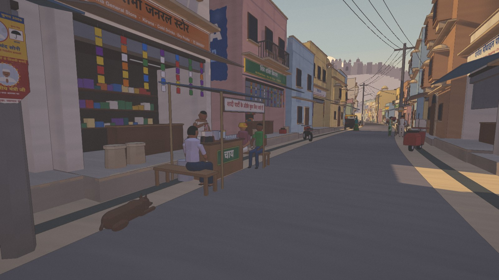
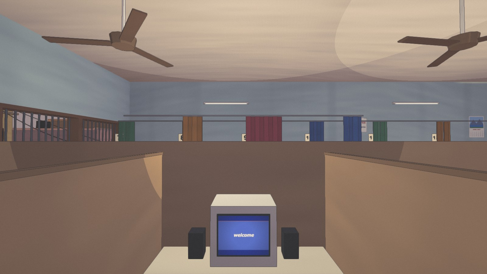
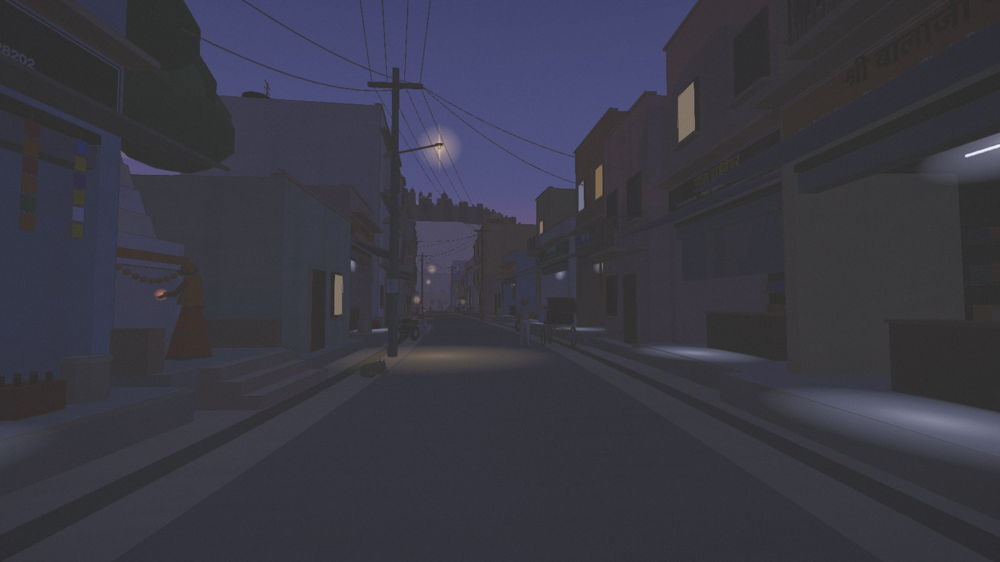

# Saturday, 5 Baje

A short first-person walk into the cyber cafes of the 2000s.

**▶ Play it in your browser: [aayushgarg2903gmailcom.itch.io/saturday-5-baje](https://aayushgarg2903gmailcom.itch.io/saturday-5-baje)**
(on a laptop or desktop, in Chrome or Safari, with sound on)



It's a Saturday afternoon in a small Rajasthan town. You walk down the market
street (the chai tapri, the kachori cart, a temple bell, kids playing gully
cricket in the gali), climb the steep stairs to the cyber cafe, and sit down
in booth 2. The modem dials.

Your best friend moved to Pune this summer, and you promised: every Saturday,
5 pm, on Yaaho! Messenger. The girl from tuition is online too, till 6.

Chat with both, download a song on dial-up, mail a photo from your pen drive,
scroll through Yorkut, watch a video buffer forever. Then log off, pay the
owner, and walk home as the tubelights flicker on.




## Controls

| | |
|---|---|
| Click | start (captures the mouse) |
| W A S D | walk |
| Mouse | look |
| Shift | walk faster |
| E | sit down / get up, pay, go home |
| Click (seated) | lean in to use the computer |
| Esc | lean back from the computer |
| T | look up at the wall clock |
| M | mute |

About 20–30 minutes.

## How it's made

- **Three.js + TypeScript**, built with Vite. `three` is the only runtime
  dependency.
- **No image or sound files.** Everything is made in code: buildings and
  people from simple shapes, every signboard, poster and photo painted on a
  canvas, and every sound synthesized with the Web Audio API (the modem, the
  ceiling fans, the temple bell, the conch, and the film tune on the chai
  tapri's radio). The whole game downloads as under 1 MB.
- **A painted, cel-shaded look**: toon shading with violet-tinted shadows, ink
  outlines and a warm colour grade (`src/render/`).
- **The computer is a web page inside the game**: a Windows XP look-alike
  desktop with its own messenger, browser and sites (`src/desktop/`). The
  story on it is plain data you can edit: `src/desktop/story.ts`.
- **The light follows the clock**, from the 4:30 pm sun to blue dusk
  (`src/render/daylight.ts`), and the street's lamps come on one by one
  (`src/world/evening.ts`).

Every name, site, brand and song in it is a look-alike (Yorkut, Yaaho!,
MeToob, Windoze XP…), and the tune is original.

## Run it yourself

You need [Node.js](https://nodejs.org) 20.19+ or 22.12+.

```bash
npm install      # once
npm run dev      # the game with dev tools: http://127.0.0.1:5180
npm run build    # the finished game, into dist/
npm run preview  # play the finished build: http://127.0.0.1:5181
```

## Where things are

- `BRIEF.md`: what the game is (the story, the look, the rules)
- `TASKS.md`: how it was built, phase by phase
- `CLAUDE.md`: how the code is organised, and the bugs that have already bitten
- `src/`: `world/` (the street and the cafe), `people/`, `audio/`,
  `desktop/` (the computer), `render/` (the look), `core/` (player, clock,
  input)
